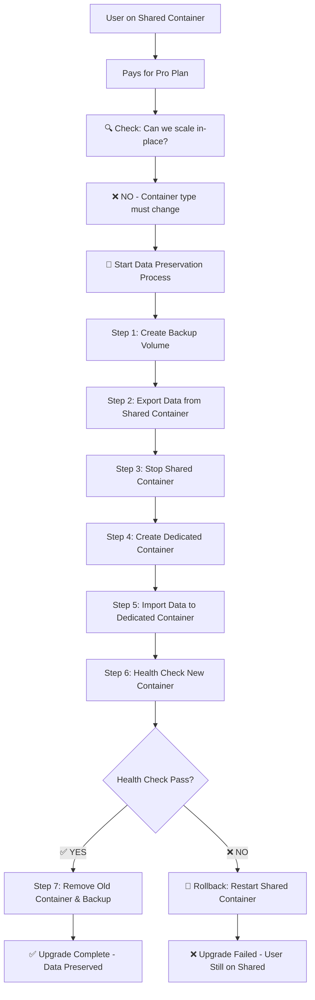
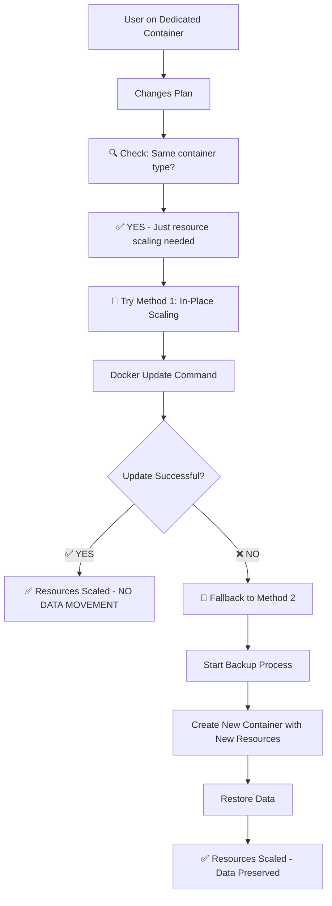

# Data Preservation & Backup Flows - Detailed Explanation

## 🔍 **When Does Data Backup/Preservation Happen?**

### **Scenario Analysis**

| Scenario | Data Backup Needed? | Why? | Method Used |
|----------|-------------------|------|-------------|
| **Shared → Dedicated** | ✅ **YES** | Container type changes | Backup → Recreate → Restore |
| **Dedicated Resource Increase** | ❌ **NO** (Preferred) | Same container, more resources | In-place scaling |
| **Dedicated Resource Decrease** | ❌ **NO** (Preferred) | Same container, fewer resources | In-place scaling |
| **In-place Scaling Fails** | ✅ **YES** (Fallback) | Docker update failed | Backup → Recreate → Restore |

## 🔄 **Flow 1: Shared → Dedicated Container (Data Import/Export)**

### **WHEN:** User upgrades from Free Trial → Paid Plan (Starter/Growth/Pro)
### **WHY:** Container type must change from "shared" to "dedicated"



### **Detailed Data Flow:**

#### **Step 1: Create Backup Volume** 
```javascript
const backupVolumeName = `${user.username}-backup-${Date.now()}`;
await docker.createDataVolume(backupVolumeName, serverHost);
```
- **What**: Creates a temporary Docker volume for data storage
- **Where**: On the same server (EC2 or EC3)
- **Why**: Secure temporary storage for user data during transition

#### **Step 2: Export Data from Shared Container**
```javascript
// Creates temporary container to backup data
const backupContainer = await docker.createContainer({
  Image: 'alpine:latest',
  Cmd: ['tar', 'czf', '/backup/user-data.tar.gz', '-C', '/source', '.'],
  HostConfig: {
    VolumesFrom: [sharedContainerName],  // Mount shared container volumes
    Binds: [`${backupVolumeName}:/backup`] // Mount backup volume
  }
});
```
- **What Exports**: 
  - All project files and source code
  - Build artifacts and compiled assets
  - Environment configuration files
  - Application logs and data
  - User-specific configurations
  - Database files (if any)
  - Uploaded files and media

#### **Step 3: Stop Shared Container** (But Don't Delete Yet!)
```javascript
await docker.stopContainer(sharedContainerName, serverHost);
// Container stopped but NOT removed - safety measure
```

#### **Step 4: Create Dedicated Container**
```javascript
const dedicatedContainerName = generateContainerName(user, newResources, serverKey);
await docker.runContainerWithVolumes('node:18-alpine', dedicatedContainerName, {
  host: serverHost,
  port: port,
  memory: newResources.ram * 1024, // Higher resources
  cpu: newResources.cpu,           // Higher resources
  volumes: [`${backupVolumeName}:/app/backup`], // Mount backup for restore
  env: [
    `USER_ID=${userId}`,
    `CONTAINER_TYPE=dedicated`,
    `ALLOCATED_CPU=${newResources.cpu}`,
    `ALLOCATED_RAM=${newResources.ram}`
  ]
});
```

#### **Step 5: Import Data to Dedicated Container**
```javascript
// Creates temporary container to restore data
const restoreContainer = await docker.createContainer({
  Image: 'alpine:latest',
  Cmd: ['sh', '-c', 'cd /target && tar xzf /backup/user-data.tar.gz'],
  HostConfig: {
    VolumesFrom: [dedicatedContainerName],    // Mount new container volumes
    Binds: [`${backupVolumeName}:/backup`]    // Mount backup volume
  }
});
```
- **What Imports**:
  - Restores ALL exported data exactly as it was
  - Maintains file permissions and directory structure
  - Preserves timestamps and metadata
  - Restores environment configurations

#### **Step 6-7: Health Check & Cleanup**
```javascript
// Verify new container is running properly
const healthCheck = await docker.getContainerStatus(dedicatedContainerName);
if (healthCheck.running) {
  // Success - remove old container and backup
  await docker.removeContainer(sharedContainerName);
  await docker.removeDataVolume(backupVolumeName);
} else {
  // Failure - rollback to old container
  await docker.startContainer(sharedContainerName);
}
```

---

## 🔄 **Flow 2: Dedicated Container Resource Scaling (No Data Migration)**

### **WHEN:** User upgrades from Pro → Premium OR downgrades Premium → Pro
### **WHY:** Same container, just different resource limits



### **Method 1: In-Place Scaling (Preferred - NO Backup Needed)**

```javascript
// Direct Docker resource update - no data movement
await docker.updateContainerResources(containerName, {
  memory: newResources.ram * 1024 * 1024, // Update RAM limit
  cpu: newResources.cpu * 1024            // Update CPU shares
}, serverHost);

// Update database immediately
await User.findByIdAndUpdate(userId, {
  resourceAllocation: newResources
});
```

**Why No Backup?**
- Same container, same data location
- Only resource limits change in Docker
- Data never moves or gets touched
- Zero downtime operation

### **Method 2: Fallback Backup (Only if Method 1 Fails)**

```javascript
// Only runs if Docker update command fails
if (!inPlaceUpdateResult.success) {
  logger.warn('In-place scaling failed, using backup method');
  return await recreateContainerWithDataPreservation(userId, newResources);
}
```

---

## 🔄 **Flow 3: All Possible Scaling Scenarios**

### **Resource Increase Scenarios:**

| From Plan | To Plan | Container Change? | Data Backup? | Method |
|-----------|---------|-------------------|--------------|--------|
| Trial (Shared) | Starter (Dedicated) | ✅ YES | ✅ YES | Backup→Recreate→Restore |
| Trial (Shared) | Growth (Dedicated) | ✅ YES | ✅ YES | Backup→Recreate→Restore |
| Trial (Shared) | Pro (Dedicated) | ✅ YES | ✅ YES | Backup→Recreate→Restore |
| Starter (Dedicated) | Growth (Dedicated) | ❌ NO | ❌ NO | In-place scaling |
| Starter (Dedicated) | Pro (Dedicated) | ❌ NO | ❌ NO | In-place scaling |
| Growth (Dedicated) | Pro (Dedicated) | ❌ NO | ❌ NO | In-place scaling |
| Pro (Dedicated) | Enterprise (Dedicated) | ❌ NO | ❌ NO | In-place scaling |

### **Resource Decrease Scenarios:**

| From Plan | To Plan | Container Change? | Data Backup? | Method |
|-----------|---------|-------------------|--------------|--------|
| Pro (Dedicated) | Growth (Dedicated) | ❌ NO | ❌ NO | In-place scaling |
| Growth (Dedicated) | Starter (Dedicated) | ❌ NO | ❌ NO | In-place scaling |
| Starter (Dedicated) | Trial (Shared) | ✅ YES | ✅ YES | Backup→Recreate→Restore |

**Note**: Downgrading from paid to free (dedicated→shared) triggers backup process because container type changes.

---

## 🛡️ **Data Preservation Details**

### **What Data Gets Backed Up?**

```bash
/app/
├── projects/                 # ✅ All user projects
│   ├── project1/
│   │   ├── source-code/     # ✅ All source files
│   │   ├── build-output/    # ✅ Compiled assets
│   │   ├── .env.local       # ✅ Environment variables
│   │   └── node_modules/    # ✅ Dependencies (if needed)
│   └── project2/
├── deployments/             # ✅ Deployment history
│   ├── deployment-123/
│   └── deployment-456/
├── uploads/                 # ✅ User uploaded files
├── logs/                    # ✅ Application logs
├── config/                  # ✅ User configurations
│   ├── domains.json
│   ├── ssl-certificates/
│   └── build-configs/
└── data/                    # ✅ Application data
    ├── databases/
    └── cache/
```

### **What's Preserved During Backup?**
- ✅ **File contents** - Exact binary copy
- ✅ **File permissions** - chmod settings maintained  
- ✅ **Directory structure** - Folder hierarchy preserved
- ✅ **Timestamps** - Creation and modification dates
- ✅ **Symbolic links** - Link relationships maintained
- ✅ **Hidden files** - .env, .git, etc. included
- ✅ **Large files** - No size restrictions
- ✅ **Database files** - SQLite, local JSON, etc.

### **Security During Backup:**
```javascript
// Backup happens on same server - no network transfer
// Temporary volume isolated per user
// Automatic cleanup after successful restore
// No other users can access backup volume
// Encrypted during transfer if using tar with compression
```

---

## 🚨 **Error Handling & Rollback Scenarios**

### **Rollback Triggers:**
1. **Backup creation fails** → User stays on old container
2. **Data export fails** → User stays on old container  
3. **New container creation fails** → Restart old container
4. **Data restore fails** → Keep new container, warn user
5. **Health check fails** → Remove new container, restart old

### **Rollback Process:**
```javascript
// If anything fails during upgrade:
try {
  // Attempt to restart original container
  await docker.startContainer(originalContainerName, serverHost);
  
  // Revert database changes
  await User.findByIdAndUpdate(userId, originalResourceAllocation);
  
  // Clean up failed resources
  await docker.removeContainer(failedContainerName, serverHost);
  await docker.removeDataVolume(backupVolumeName, serverHost);
  
  logger.error('Upgrade failed, rolled back successfully');
  return { success: false, error: 'Upgrade failed, rolled back to original state' };
} catch (rollbackError) {
  // Critical error - manual intervention needed
  logger.error('CRITICAL: Rollback failed', { userId, error: rollbackError });
}
```

---

## ⏱️ **Performance & Timing**

### **Backup/Restore Duration Estimates:**

| Data Size | Backup Time | Restore Time | Total Downtime |
|-----------|-------------|--------------|----------------|
| **< 100MB** | 5-10 seconds | 5-10 seconds | ~30 seconds |
| **100MB - 1GB** | 30-60 seconds | 30-60 seconds | ~2-3 minutes |
| **1GB - 5GB** | 2-5 minutes | 2-5 minutes | ~8-12 minutes |
| **> 5GB** | 5-15 minutes | 5-15 minutes | ~20-30 minutes |

### **In-Place Scaling Duration:**
- **Resource increase/decrease**: **< 1 second**
- **Zero downtime**: Services keep running during scaling
- **Instant effect**: New limits applied immediately

---

## 📊 **Summary: When Backup is Needed**

### **🔄 Backup Required (Container Type Change):**
- ✅ Free Trial → Any Paid Plan (shared → dedicated)
- ✅ Any Paid Plan → Free Trial (dedicated → shared)  
- ✅ When in-place scaling fails (fallback method)

### **⚡ No Backup Needed (Resource Scaling):**
- ✅ Starter → Growth → Pro → Enterprise (all dedicated)
- ✅ Enterprise → Pro → Growth → Starter (all dedicated)
- ✅ Any dedicated plan resource adjustment

### **🎯 Key Principle:**
**Container Type Change = Backup Required**
**Resource Change Only = No Backup Needed**

This ensures maximum performance and minimal downtime while guaranteeing 100% data preservation in all scenarios!
