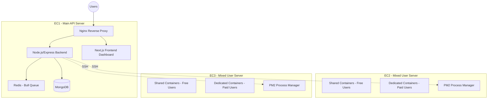

# 🏗️ Hosting Platform — Complete System Documentation

> **Last Updated:** April 13, 2026 13:08 PKT — Deep Review Session (Phase 2)
> This document is continuously updated as new issues are found and fixed.

---

## 1. Architecture Overview



### Server Roles
| Server | Role | Purpose |
|--------|------|---------|
| EC1 | API + Frontend | Hosts the Express API, Next.js dashboard, MongoDB, Redis |
| EC2 | Mixed Users | Free (shared) + Paid (dedicated) user containers |
| EC3 | Mixed Users | Free (shared) + Paid (dedicated) user containers |

### Technology Stack
- **Backend:** Node.js + Express.js
- **Database:** MongoDB (Mongoose ODM)
- **Queue:** Redis + Bull
- **Deploy Host:** Docker containers + PM2
- **Frontend Dashboard:** Next.js (React)
- **Templates:** Next.js (Portfolio, Blog, Commerce) + Vue.js (Restaurant)
- **SSH Tunnel:** node-ssh for remote server management

---

## 2. Authentication System

### 2.1 OAuth Providers
- **GitHub OAuth** — Primary auth, grants repo access (`user:email`, `repo` scopes)
- **Google OAuth** — Secondary auth (`profile`, `email` scopes)
- **Direct Login** — Email/password with bcrypt hashing

### 2.2 Token Management
- **JWT tokens** with 7-day expiry
- Stored as HTTP-only cookies (`auth_token`)
- Payload: `{ userId, username, email, role }`
- Token refresh endpoint available at `POST /api/auth/refresh`

### 2.3 API Key Auth
- Users can generate named API keys
- Used for CLI deployments and webhook triggers
- Keys stored hashed in user's `apiKeys` array

### 2.4 Access Control
| Role | Access |
|------|--------|
| `user` | Own projects, deployments, billing |
| `admin` | Everything + admin panel, user management, plan management |

### 2.5 User Status States
| Status | Behavior |
|--------|----------|
| `active` | Full access |
| `suspended` | Read-only, no deployments, can view dashboard |
| `deleted` | Blocked from login entirely |
| `banned` | Blocked from login entirely |

---

## 3. Payment & Billing System

### 3.1 Supported Gateways

| Gateway | Currency | Type | Webhook Signature |
|---------|----------|------|-------------------|
| **Paddle** | USD/EUR/GBP | Automated recurring | HMAC-SHA256 (raw body) |
| **BTCPay** | BTC | Automated one-time | HMAC-SHA256 |
| **JazzCash** | PKR | Mobile wallet | HMAC-SHA256 (sorted fields) |
| **EasyPaisa** | PKR | Mobile wallet | HMAC-SHA256 |
| **Manual Bank** | Any | Admin-verified | N/A (admin approval) |
| **Manual Crypto** | Any | Admin-verified | N/A (admin approval) |

### 3.2 Billing Flow
```
User selects plan → Choose billing period (1/3/6/12 months)
  → Choose gateway → Create payment session
  → Gateway processes payment → Webhook received
  → Verify signature → Update user subscription
  → Set resource allocation (3 fields):
     • resourceAllocation (actual enforcement limits)
     • displayedResources (what user sees in dashboard)
     • allocatedResources (admin reference)
  → Update container resources via Docker
```

### 3.3 Billing Periods & Discounts
Plans support multi-month billing with configurable discounts:
- **Monthly (1 month):** Base price
- **Quarterly (3 months):** Configurable discount (default 5%)
- **Semi-Annual (6 months):** Configurable discount (default 10%)
- **Annual (12 months):** Configurable discount (default 20%)

### 3.4 Subscription Lifecycle
```
trial → active → past_due → suspended → deleted
         ↑                      ↓
         └── payment verified ──┘
```

### 3.5 Grace Period
- Each billing period has a configurable grace period (default 10 days)
- During grace: user notified, service continues
- After grace: status → `suspended`, containers paused
- 30 days after suspension: scheduled deletion

### 3.6 Paddle Integration (Primary Gateway)
- Mounted BEFORE `express.json()` for raw body HMAC verification
- Handles: `subscription.created`, `subscription.updated`, `subscription.canceled`, `transaction.completed`, `transaction.payment_failed`
- Cancellation: Local cancel route calls `paddleService.cancelSubscription()` to stop recurring charges

---

## 4. Plan System

### 4.1 Plan Model Structure
```javascript
{
  name, displayName, description,
  pricing: { usd, pkr, eur, gbp },
  resources: { cpu, ram, storage, bandwidth, containers, projects },
  displayResources: { ... },  // What users SEE
  actualResources: { ... },   // What backend ENFORCES
  features: [{ name, displayName, description, enabled, config }],
  limits: { deploymentsPerDay, buildsPerDay, domainsPerProject, ... },
  billingPeriods: [{ months, discountPercent, gracePeriodDays, enabled }],
  paddlePriceIds: { sandbox: {...}, live: {...} }
}
```

### 4.2 Default Plans
| Plan | USD/mo | CPU | RAM | Storage | Projects |
|------|--------|-----|-----|---------|----------|
| Free Trial | $0 | 0.5 | 1GB | 10GB | 3 |
| Starter | $9 | 1 | 4GB | 50GB | 10 |
| Growth | $29 | 2 | 12GB | 100GB | 25 |
| Pro | $59 | 3 | 20GB | 200GB | 50 |
| Enterprise | $199 | 4 | 24GB | 500GB | 100 |

---

## 5. Deployment Pipeline

### 5.1 Build Flow
```
GitHub push → Webhook → Verify signature
  → Create Deployment record (status: queued)
  → Add to Bull queue → Build executor processes:
    1. Clone repo via SSH
    2. Install dependencies (npm/yarn/pnpm)
    3. Detect framework (Next.js, Vue, etc.)
    4. Run build command
    5. Set up PM2 process in user container
    6. Configure Nginx routing
    7. Mark deployment as 'success'
  → WebSocket notifies dashboard in real-time
```

### 5.2 Build Queue (Bull + Redis)
- Configurable concurrency (`BUILD_CONCURRENCY` env var, default: 2)
- Job ID format: `deployment-{deploymentId}`
- Stalled job detection with auto-failure marking
- Manual retry support (removes old job, creates new with priority)

### 5.3 Template Deployment
Templates are deployed through the same pipeline but with pre-configured settings:
- **Next.js Portfolio** — Blog, Projects, Contact
- **Next.js Commerce** — Products, Cart, Orders, Reviews
- **Next.js Blog Smart** — Blog posts with CRUD
- **Vue Restaurant** — Restaurant site with Express API backend

Each template has:
- Prisma ORM for SQLite database
- Owner authentication via HMAC token → `pl_owner` cookie
- Setup page for seeding sample data
- `basePath` support for subdirectory hosting

---

## 6. Container Orchestration

### 6.1 Architecture
- **Every user gets a dedicated container** (simplified from shared/dedicated)
- Containers run PM2 for process management
- Load balanced between EC2 and EC3 (least-users wins)

### 6.2 Resource Scaling
```
Plan upgrade → scaleContainerResources()
  → Try docker.updateContainerResources() (in-place)
  → If fails → recreateContainerWithDataPreservation()
    → PM2 save → docker cp backup → create new container → restore data
```

### 6.3 Container Lifecycle
- **Allocation:** `assignUserToServer()` → `allocateContainer()` → `freeTierContainer.createUserContainer()`
- **Upgrade:** `upgradeUserPlan()` → Scale resources or migrate shared→dedicated
- **Suspension:** Container paused, PM2 processes stopped
- **Deletion:** Container removed, Nginx config cleaned

---

## 7. Domain & SSL Management

- Custom domain mapping via Nginx config
- SSL via Let's Encrypt (Certbot)
- Domain verification via DNS TXT record
- Multiple domains per project (limit based on plan)

---

## 8. Project Model

### 8.1 Key Fields
```javascript
{
  owner: ObjectId (ref: User),  // ⚠️ NOT userId — always use project.owner
  name, repoUrl, framework,
  repository: { fullName, branch, defaultBranch },
  environmentVariables: [{ key, value }],
  customDomains: [...],
  collaborators: [{ user, role }],
}
```

### 8.2 Access Control
- `project.hasAccess(userId, role)` — Checks owner + collaborators
- Roles: `viewer`, `developer`, `admin`

---

## 9. Notification System

### 9.1 Email Notifications
- Welcome email on signup
- Payment verified / failed
- Subscription expiring / suspended
- Deployment success / failure
- New user signup (admin notification)

### 9.2 Implementation
- Uses Nodemailer with SMTP
- HTML email templates with inline styles
- Graceful failure (non-blocking, logged as warning)

---

## 10. Cron Jobs

| Cron | Schedule | Purpose |
|------|----------|---------|
| `subscriptionCron` | Every 6 hours | Check expired subs, apply grace periods, suspend/delete |
| `accountLifecycleCron` | Daily | Trial expiry, scheduled deletions, cleanup |
| `exchangeRateCron` | Every 6 hours | Update PKR/USD exchange rates |
| `resourceMonitoring` | Every 5 min | Monitor server load, alert on high usage |

---

## 11. Security

### 11.1 Webhook Security
All webhooks require mandatory HMAC-SHA256 signature verification:
- **GitHub:** `X-Hub-Signature-256` header vs `rawBody`
- **Paddle:** Custom verify via Paddle SDK (raw body before JSON parse)
- **BTCPay:** `BTCPay-Sig` header vs `rawBody`
- **JazzCash:** `pp_SecureHash` field in sorted payload
- **EasyPaisa:** Similar hash verification

### 11.2 Rate Limiting
- OAuth endpoints: 10 attempts/minute/IP
- API endpoints: Standard Express rate limiting

### 11.3 Admin Exemptions
- Admin accounts bypass suspension and trial expiry logic
- Admin status checked via `user.role === 'admin'`

---

## 12. API Routes Reference

| Route | Auth | Description |
|-------|------|-------------|
| `GET /api/auth/me` | Token | Get current user |
| `GET /api/auth/github` | None | Start GitHub OAuth |
| `POST /api/auth/login` | None | Email/password login |
| `POST /api/auth/register` | None | Direct registration |
| `GET /api/billing/plans` | None | Public plans listing |
| `POST /api/billing/create-session-*` | Auth | Create payment session |
| `POST /api/billing/cancel` | Auth | Cancel subscription |
| `POST /api/webhooks/github` | Signature | GitHub push events |
| `POST /api/webhooks/paddle` | Signature | Paddle payment events |
| `POST /api/webhooks/btcpay` | Signature | BTCPay payment events |
| `POST /api/webhooks/jazzcash` | Signature | JazzCash callback |
| `POST /api/webhooks/easypaisa` | Signature | EasyPaisa callback |
| `GET /api/projects` | Auth | List user's projects |
| `POST /api/projects` | Auth | Create project |
| `GET /api/deployments` | Auth | List deployments |
| `POST /api/deployments/:id/rollback` | Auth | Rollback deployment |
| `GET /api/admin/*` | Admin | Admin panel routes |
| `GET /api/analytics/*` | Auth | Analytics data |
| `GET /api/resources/*` | Auth | Resource monitoring |

---

## 13. Environment Variables

### 13.1 Critical (Server won't start without these)
```
JWT_SECRET, SESSION_SECRET, MONGODB_URI
```

### 13.2 Server Config
```
EC2_SERVER_IP, EC3_SERVER_IP
REDIS_HOST, REDIS_PORT, REDIS_PASSWORD
FRONTEND_URL, BACKEND_URL
```

### 13.3 Payment Gateways
```
PADDLE_API_KEY, PADDLE_WEBHOOK_SECRET
BTCPAY_SERVER_URL, BTCPAY_API_KEY, BTCPAY_WEBHOOK_SECRET
JAZZCASH_MERCHANT_ID, JAZZCASH_PASSWORD, JAZZCASH_INTEGRITY_SALT
EASYPAISA_MERCHANT_ID, EASYPAISA_HASH_KEY
```

### 13.4 OAuth
```
GITHUB_CLIENT_ID, GITHUB_CLIENT_SECRET
GOOGLE_CLIENT_ID, GOOGLE_CLIENT_SECRET
```

---

## 14. Template System

### 14.1 Templates Available

| Template | Framework | Database | Features |
|----------|-----------|----------|----------|
| nextjs-portfolio | Next.js 14+ | SQLite (Prisma) | Projects, Blog, Contact, Setup |
| nextjs-commerce | Next.js 14+ | SQLite (Prisma) | Products, Cart, Orders, Reviews, Wishlist |
| nextjs-blog-smart | Next.js 14+ | SQLite (Prisma) | Blog posts CRUD, RSS, About |
| vue-restaurant | Vue 3 + Express | MongoDB | Menu, Reservations, Reviews |

### 14.2 Template Auth
- Owner verification via HMAC-SHA256 token
- Token generated by backend, passed as `?token=` query param
- Verified by template's `/api/auth` route → sets `pl_owner` cookie
- Setup pages gated by `pl_owner` cookie

### 14.3 Template Config
Each template reads `NEXT_PUBLIC_BASE_PATH` for subdirectory hosting:
- Portfolio: Uses `dotenv` explicit load in `next.config.js`
- Commerce: Reads from process.env directly
- Blog: Uses `dotenv` explicit load
- Restaurant: Uses Vite config `base` option

---

## 15. Bugs Found & Fixed This Session

| # | Bug | Severity | File | Fix |
|---|-----|----------|------|-----|
| 16 | `project.userId` → `project.owner` in deployments | 🔴 Critical | deployments.js:774 | Changed to `project.hasAccess()` |
| 17 | `project.userId` → `project.owner` in admin rebuild | 🔴 Critical | admin.js:2148-2170 | Changed all 3 refs to `project.owner` |
| 18 | Malware in postcss.config.js | 🔴 Security | frontend/postcss.config.js | Deleted file |
| 19 | Malware in vite.config.js | 🔴 Security | vue-restaurant/vite.config.js | Already cleaned in staged commit |
| 20 | Wrong env var `_HOST` → `_SERVER_IP` (9 files) | 🔴 Critical | webhooks.js, admin.js, webhooks-paddle.js, subscriptionCron.js, containerUpgrade.js | All 9 fixed — EC2 users' container updates were targeting EC3 |
| 21 | `scaleContainerResources` null crash | 🟡 Medium | containerOrchestrator.js:594 | `getUserContainer()` returns null, code checks `.success` |
| 22 | Duplicate schema fields in Project model | 🟢 Low | Project.js:182-256 | `latestDeployment` and `productionDeployment` declared twice |
| 23 | Duplicate exports in containerOrchestrator | 🟢 Low | containerOrchestrator.js:1425-1441 | `ORACLE_SERVERS` exported twice |
| 24 | Security: JWT fallback secret | 🟡 Medium | middleware/auth.js:27 | Falls back to `'your-secret-key'` if env missing |
| 25 | Invitation token leaked in API response | 🟢 Low | invitations.js:101 | Token exposed in 400 response — **FIXED** |
| 26 | `const port` reassigned on retry → crash | 🔴 Critical | freeTierContainer.js:173 | `const port` reassigned on collision retry → `TypeError` — **FIXED** to `let` |
| 27 | `_HOST` bug in 3 more files (9 instances) | 🔴 Critical | accountLifecycle.js, containerUpgrade.js, completeDomainMigration.js | Container ops targeting wrong server — **FIXED** |
| 28 | Missing `emailService` module → crash | 🔴 Critical | domainMigration.js:5 | `require('./emailService')` doesn't exist — **FIXED** to `notificationService` |

### Previous Session Bugs (1-15)
- Upstream Paddle cancel, resource allocation consistency, webhook signature enforcement, Payoneer dead code removal, etc. See `final_audit_report.md` for details.

---

*This document will be updated as the review continues.*
